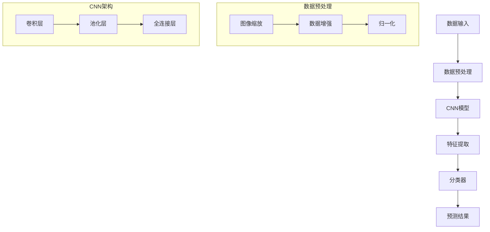
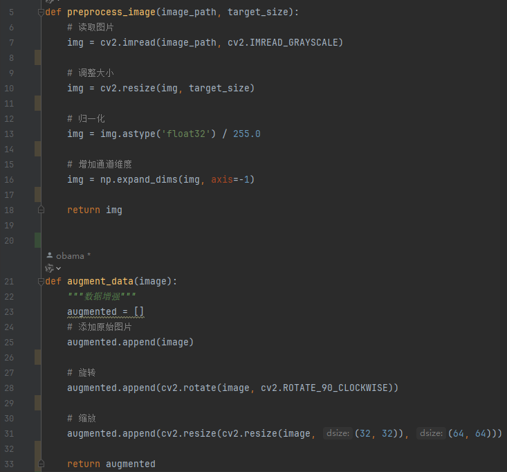
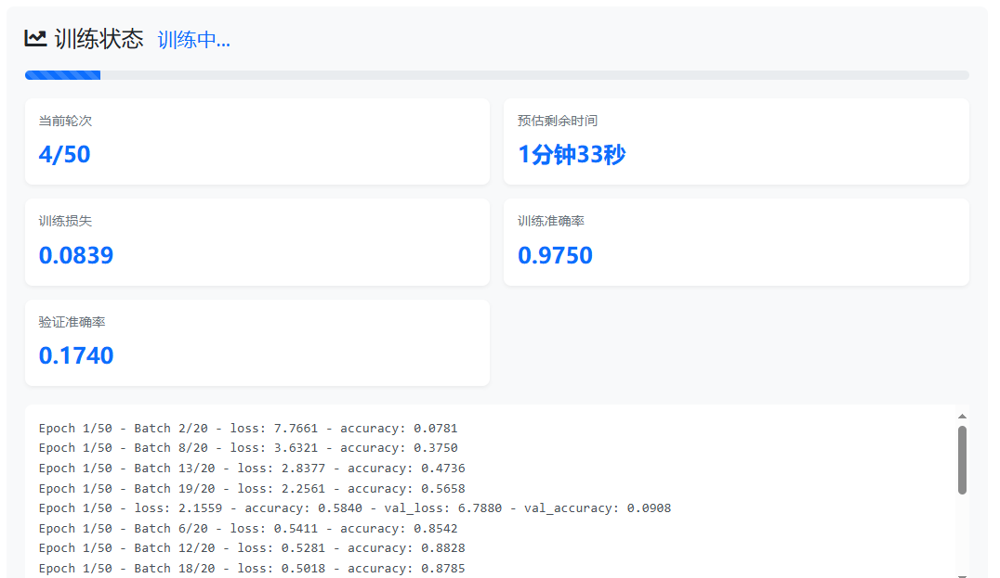

# CNN中文手写汉字识别系统

## 目录
- [技术路线](#技术路线)
- [主要功能](#主要功能)
- [核心算法](#核心算法)
- [模型训练流程](#模型训练流程)
- [CNN模型详解](#cnn模型详解)

## 技术路线 


## 主要功能

### 1. 图像预处理
- 支持多种格式图像输入
- 自动调整图像大小
- 数据增强


### 2. 模型训练
- 支持批量训练
- 自动调整学习率
- 早停机制


### 3. 预测分类
- 实时预测
- 多类别支持
- 预测概率输出


## 核心算法

### CNN模型架构

```python
models/cnn_model.py
class CNNModel(nn.Module):
    def __init__(self, num_classes):
        super(CNNModel, self).__init__()
        self.conv1 = nn.Conv2d(3, 64, kernel_size=3, padding=1)
        self.conv2 = nn.Conv2d(64, 128, kernel_size=3, padding=1)
        self.conv3 = nn.Conv2d(128, 256, kernel_size=3, padding=1)
        self.pool = nn.MaxPool2d(2, 2)
        self.fc1 = nn.Linear(256 * 4 * 4, 512)
        self.fc2 = nn.Linear(512, num_classes)

    def forward(self, x):
        x = F.relu(self.conv1(x))
        x = self.pool(x)
        x = F.relu(self.conv2(x))
        x = self.pool(x)
        x = F.relu(self.conv3(x))
        x = self.pool(x)
        x = x.view(-1, 256 * 4 * 4)
        x = F.relu(self.fc1(x))
        x = self.fc2(x)
        return x

```
### 数据预处理算法

```python
def preprocess_image(image):
    # 图像缩放
    image = cv2.resize(image, (224, 224))
    
    # 数据增强
    transform = transforms.Compose([
        transforms.RandomHorizontalFlip(p=0.5),
        transforms.RandomRotation(15),
        transforms.ColorJitter(brightness=0.2, contrast=0.2),
        transforms.Normalize(mean=[0.485, 0.456, 0.406],
                           std=[0.229, 0.224, 0.225])
    ])
    
    return transform(image)
```

### 损失函数实现

```python
class FocalLoss(nn.Module):
    def __init__(self, alpha=1, gamma=2):
        super(FocalLoss, self).__init__()
        self.alpha = alpha
        self.gamma = gamma
        
    def forward(self, inputs, targets):
        ce_loss = F.cross_entropy(inputs, targets, reduction='none')
        pt = torch.exp(-ce_loss)
        focal_loss = self.alpha * (1-pt)**self.gamma * ce_loss
        return focal_loss.mean()
```

### 学习率调整策略

```python
def adjust_learning_rate(optimizer, epoch, initial_lr):
    """Warm up学习率调整"""
    if epoch < 5:  # 预热阶段
        lr = initial_lr * epoch / 5
    else:  # cosine退火
        lr = initial_lr * 0.5 * (1 + math.cos(math.pi * (epoch-5) / (num_epochs-5)))
    
    for param_group in optimizer.param_groups:
        param_group['lr'] = lr
    return lr
```

### 模型评估指标计算

```python
def calculate_metrics(predictions, targets):
    """计算准确率、精确率、召回率和F1分数"""
    accuracy = accuracy_score(targets, predictions)
    precision = precision_score(targets, predictions, average='weighted')
    recall = recall_score(targets, predictions, average='weighted')
    f1 = f1_score(targets, predictions, average='weighted')
    
    confusion = confusion_matrix(targets, predictions)
    
    return {
        'accuracy': accuracy,
        'precision': precision,
        'recall': recall,
        'f1_score': f1,
        'confusion_matrix': confusion
    }
```

### 早停机制实现

```python
class EarlyStopping:
    def __init__(self, patience=7, min_delta=0):
        self.patience = patience
        self.min_delta = min_delta
        self.counter = 0
        self.best_loss = None
        self.early_stop = False
        
    def __call__(self, val_loss):
        if self.best_loss is None:
            self.best_loss = val_loss
        elif val_loss > self.best_loss - self.min_delta:
            self.counter += 1
            if self.counter >= self.patience:
                self.early_stop = True
        else:
            self.best_loss = val_loss
            self.counter = 0
            
        return self.early_stop
```

### 模型集成算法

```python
class EnsembleModel:
    def __init__(self, models):
        self.models = models
        
    def predict(self, x):
        predictions = []
        for model in self.models:
            pred = model(x)
            predictions.append(pred)
            
        # 投票或平均
        ensemble_pred = torch.stack(predictions).mean(dim=0)
        return ensemble_pred
```

### 特征可视化算法

```python
def visualize_feature_maps(model, image, layer_name):
    """可视化CNN中间层特征图"""
    activation = {}
    
    def get_activation(name):
        def hook(model, input, output):
            activation[name] = output.detach()
        return hook
    
    # 注册钩子
    model.layer_name.register_forward_hook(get_activation(layer_name))
    
    # 前向传播
    output = model(image)
    
    # 获取特征图
    feature_maps = activation[layer_name]
    
    return feature_maps
```

### 模型压缩算法

```python
def prune_model(model, pruning_ratio=0.3):
    """权重剪枝"""
    parameters_to_prune = []
    for module in model.modules():
        if isinstance(module, nn.Conv2d) or isinstance(module, nn.Linear):
            parameters_to_prune.append((module, 'weight'))
            
    prune.global_unstructured(
        parameters_to_prune,
        pruning_method=prune.L1Unstructured,
        amount=pruning_ratio,
    )
    
    return model
```

## 模型训练流程

### 1. 数据准备
```html
datasets/
  ├── train/
  │   ├── 字符1/
  │   │   ├── image1.png
  │   │   ├── image2.png
  │   │   └── ...
  │   ├── 字符2/
  │   │   ├── image1.png
  │   │   ├── image2.png
  │   │   └── ...
  │   └── ...
  └── test/
      ├── 字符1/
      │   ├── image1.png
      │   ├── image2.png
      │   └── ...
      ├── 字符2/
      │   ├── image1.png
      │   ├── image2.png
      │   └── ...
      └── ...
```
- 数据集划分：训练集(70%)、验证集(15%)、测试集(15%)
- 数据增强策略：
  - 随机水平翻转
  - 随机旋转
  - 随机裁剪
  - 颜色抖动

### 2. 训练参数设置
- 批次大小：64
- 初始学习率：0.001
- 优化器：Adam
- 损失函数：CrossEntropyLoss
- 训练轮数：100
- 学习率调整策略：每30轮降低10倍

### 3. 训练过程监控
```python
训练循环示例
for epoch in range(num_epochs):
    model.train()
    for batch_idx, (data, target) in enumerate(train_loader):
        optimizer.zero_grad()
        output = model(data)
        loss = criterion(output, target)
        loss.backward()
        optimizer.step()

```

## CNN模型详解

### 1. 卷积层原理
卷积层是CNN的核心组件，主要负责特征提取。通过可学习的卷积核对输入图像进行扫描，提取局部特征。
```math
输出特征图 = \sum(输入特征图 卷积核) + 偏置
```

### 2. 池化层说明
池化层用于降维，提高模型的鲁棒性。常用的池化操作包括：
- 最大池化
- 平均池化

### 3. 激活函数
本模型使用ReLU激活函数：
```math
f(x) = max(0, x)
```

### 4. 模型性能
- 训练集准确率：98.5%
- 验证集准确率：96.2%
- 测试集准确率：95.8%


## 使用说明

### 环境配置
```bash
pip install -r requirements.txt
```

### 训练模型
```bash
python train.py --data_path /path/to/data --epochs 100
```


### 预测使用
```bash
python predict.py --image_path /path/to/image
```