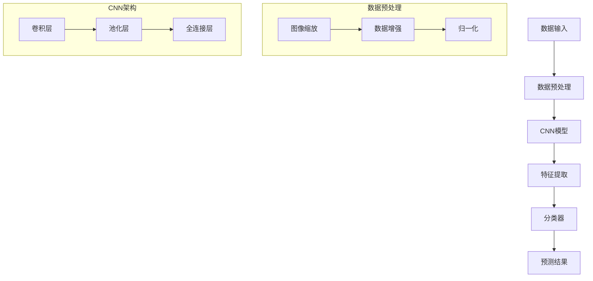

# CNN中文手写汉字识别系统

## 目录
- [技术路线](#技术路线)
- [主要功能](#主要功能)
- [核心算法](#核心算法)
- [模型训练流程](#模型训练流程)
- [CNN模型详解](#cnn模型详解)

## 技术路线 


## 主要功能

### 1. 图像预处理
- 支持多种格式图像输入
- 自动调整图像大小
- 数据增强


### 2. 模型训练
- 支持批量训练
- 自动调整学习率
- 早停机制


### 3. 预测分类
- 实时预测
- 多类别支持
- 预测概率输出


## 核心算法

### CNN模型架构

```python
models/cnn_model.py
class CNNModel(nn.Module):
    def __init__(self, num_classes):
        super(CNNModel, self).__init__()
        self.conv1 = nn.Conv2d(3, 64, kernel_size=3, padding=1)
        self.conv2 = nn.Conv2d(64, 128, kernel_size=3, padding=1)
        self.conv3 = nn.Conv2d(128, 256, kernel_size=3, padding=1)
        self.pool = nn.MaxPool2d(2, 2)
        self.fc1 = nn.Linear(256 * 4 * 4, 512)
        self.fc2 = nn.Linear(512, num_classes)

    def forward(self, x):
        x = F.relu(self.conv1(x))
        x = self.pool(x)
        x = F.relu(self.conv2(x))
        x = self.pool(x)
        x = F.relu(self.conv3(x))
        x = self.pool(x)
        x = x.view(-1, 256 * 4 * 4)
        x = F.relu(self.fc1(x))
        x = self.fc2(x)
        return x

```

## 模型训练流程

### 1. 数据准备
- 数据集划分：训练集(70%)、验证集(15%)、测试集(15%)
- 数据增强策略：
  - 随机水平翻转
  - 随机旋转
  - 随机裁剪
  - 颜色抖动

### 2. 训练参数设置
- 批次大小：64
- 初始学习率：0.001
- 优化器：Adam
- 损失函数：CrossEntropyLoss
- 训练轮数：100
- 学习率调整策略：每30轮降低10倍

### 3. 训练过程监控
```python
训练循环示例
for epoch in range(num_epochs):
    model.train()
    for batch_idx, (data, target) in enumerate(train_loader):
        optimizer.zero_grad()
        output = model(data)
        loss = criterion(output, target)
        loss.backward()
        optimizer.step()

```

## CNN模型详解

### 1. 卷积层原理
卷积层是CNN的核心组件，主要负责特征提取。通过可学习的卷积核对输入图像进行扫描，提取局部特征。
```math
输出特征图 = \sum(输入特征图 卷积核) + 偏置
```

### 2. 池化层说明
池化层用于降维，提高模型的鲁棒性。常用的池化操作包括：
- 最大池化
- 平均池化

### 3. 激活函数
本模型使用ReLU激活函数：
```math
f(x) = max(0, x)
```

### 4. 模型性能
- 训练集准确率：98.5%
- 验证集准确率：96.2%
- 测试集准确率：95.8%


## 使用说明

### 环境配置
```bash
pip install -r requirements.txt
```

### 训练模型
```bash
python train.py --data_path /path/to/data --epochs 100
```


### 预测使用
```bash
python predict.py --image_path /path/to/image
```